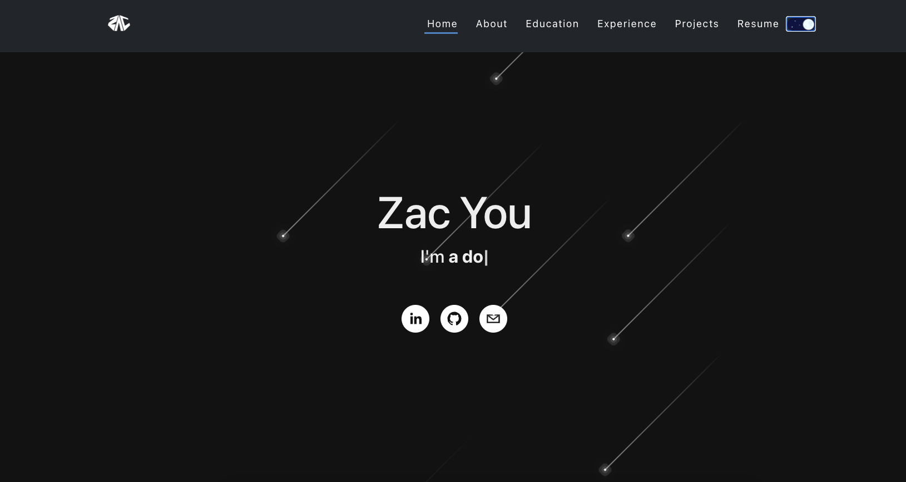
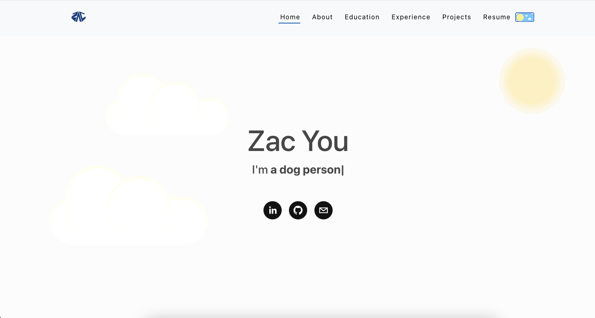
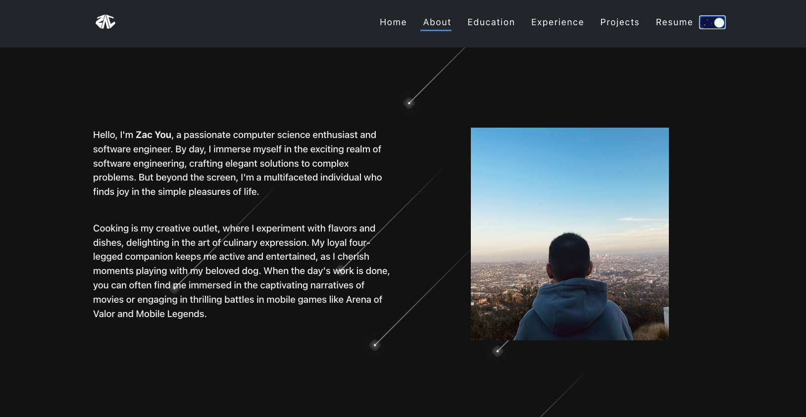
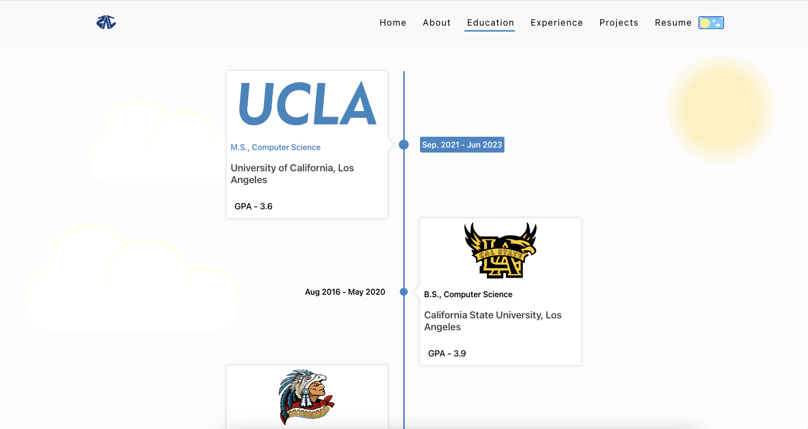
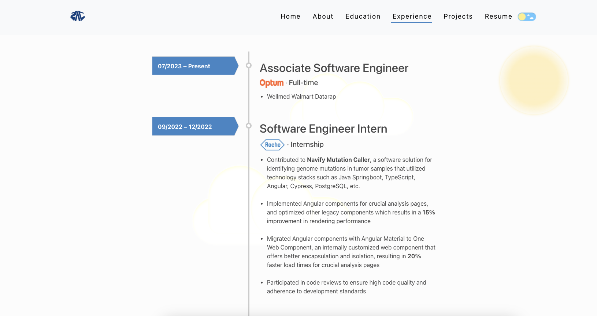
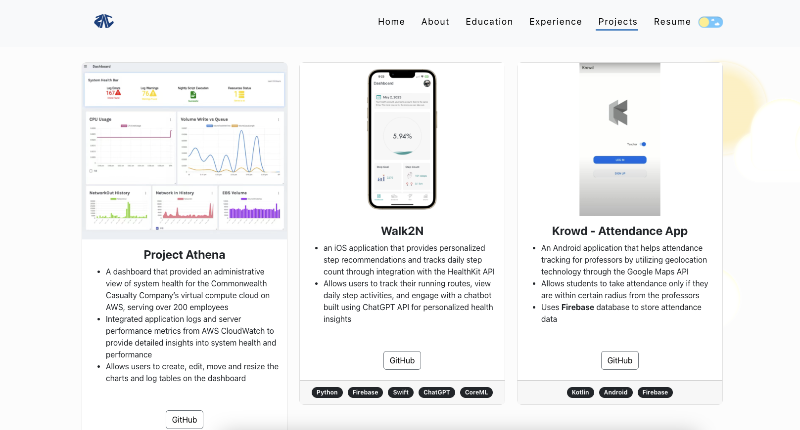

## How to run the app
Clone the repository to your local by the following command:
```
git clone https://github.com/ZacYoutube/PersonalWebsite.git
```
Then navigate into my-porforlio directory and start the react app by the following command:
```
cd my-portfolio
npm start
```


## Home Page



## About Page


## Education Page


## Experience Page


## Project Page
